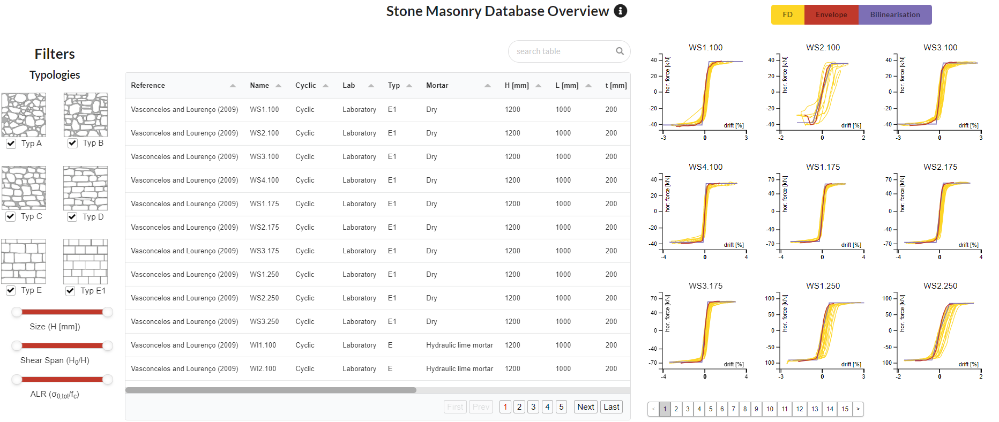

# EESD Stone Masonry Database Dashboard
The aim of this web application is to give an interactive and intuitive representation of the database from the paper [Vanin et al. (2017) "Estimates for the stiffness, strength and drift capacity of stone masonry walls based on 123 quasi-static cyclic tests reported in the literature"](https://doi.org/10.1007/s10518-017-0188-5).

The data consists of quasi-static cyclic tests on stone masonry walls and the graphs show the important parameters and their distribution within the database.

The database can also be accessed [here](https://zenodo.org/record/812146#.YXaBUJ5ByUl). This database is maintained and updated as new test results become available. 

The first tab consists of plots that correspond to the subplots of Figure 4 in the paper, which represents the database of shear-compression tests on the stone masonry walls.

The second tab shows the actual data of the database in a filterable data table, along with the corresponding force-displacement response curves for each line.

## Project status
The dashboard is under active development. A first version will be available by Dec 2021.

* Prototype v.1 running at [eesd-stone-masonry.herokuapp.com](https://eesd-stone-masonry.herokuapp.com/)
* Prototype v.2 is running at [https://eesd-epfl.github.io/eesd-dashboard/](https://eesd-epfl.github.io/eesd-dashboard/)

## Getting started

### Dependencies

All dependencies are located in HTML files and use CDN (online sources) to fetch required JS/CSS libraries.

A recent Web Browser is required (Chrome, Mozilla, Safari, etc.).
Using Internet Explorer will most likely result in errors.

When running locally, a local server is required.

A Python 3 HTTP Server was used to run the website locally.

HTML Javascript modules and versions are:
- C3 v0.7.20
- D3 v5.16.0
- Papaparse v5.3.1
- XLS v0.7.6
- JQuery v3.6.0
- Semantic UI v2.4.1
- JSZip v3.7.1
- JSZip Utils v0.1.0
- FileSaver v2.0.5
- Tabulator v5.0.7
- noUiSlider v15.5.0

### How to install

Nothing to install.

### How to run

Using Python3:

python -m http.server 8000 --bind 127.0.0.1

Go to http://localhost:8000/ to visualise the dashboard.

## Reference
Vanin F., Zaganelli D., Penna A., Beyer K. (2017). Estimates for the stiffness, strength and drift capacity of stone masonry walls based on 123 quasi-static cyclic tests reported in the literature. Bull Earthquake Eng 15, 5435–5479 (2017). [https://doi.org/10.1007/s10518-017-0188-5](https://doi.org/10.1007/s10518-017-0188-5)]

## Data
Database: Vanin F., Zaganelli D., Penna A., Beyer K. (2017). Data set to "Estimates for the stiffness, strength and drift capacity of stone masonry walls based on 123 quasi-static cyclic tests reported in the literature". [http://doi.org/10.5281/zenodo.812145](http://doi.org/10.5281/zenodo.812145)]

# Authors 
Developer - Patrick Loeliger

Project Lead - Charlotte Weil

Contributors - Katrin Beyer and Ivana Bozulic

# License 
MIT License

Copyright (c) 2021 Earthquake Engineering and Structural Dynamics Laboratory. Ecole Polytechnique Fédérale de Lausanne (EPFL)

Permission is hereby granted, free of charge, to any person obtaining a copy
of this software and associated documentation files (the "Software"), to deal
in the Software without restriction, including without limitation the rights
to use, copy, modify, merge, publish, distribute, sublicense, and/or sell
copies of the Software, and to permit persons to whom the Software is
furnished to do so, subject to the following conditions:

The above copyright notice and this permission notice shall be included in all
copies or substantial portions of the Software.

THE SOFTWARE IS PROVIDED "AS IS", WITHOUT WARRANTY OF ANY KIND, EXPRESS OR
IMPLIED, INCLUDING BUT NOT LIMITED TO THE WARRANTIES OF MERCHANTABILITY,
FITNESS FOR A PARTICULAR PURPOSE AND NONINFRINGEMENT. IN NO EVENT SHALL THE
AUTHORS OR COPYRIGHT HOLDERS BE LIABLE FOR ANY CLAIM, DAMAGES OR OTHER
LIABILITY, WHETHER IN AN ACTION OF CONTRACT, TORT OR OTHERWISE, ARISING FROM,
OUT OF OR IN CONNECTION WITH THE SOFTWARE OR THE USE OR OTHER DEALINGS IN THE
SOFTWARE.